# CSS
## benefits
**maintainability, readability, performance, and modularity.**
- CSS is maintainable because all formatting is centralized, making site-wide changes very easy and consistent.
- CSS makes HTML readable, because it removes all styles that historically cluttered HTML files.
- CSS improves download speeds because HTML has less code to parse on demand.
- CSS improves modularity because now that styles are separated into their own files, they can be recycled for other apps and save a ton of rework.

## SYNTAX
```css
selector{ property1:value1; property2:value2;}
```
- Declaration blocks can be on a single line, or spread across multiple lines if they have more than one declaration.
- Each declaration is terminated with a semicolon.
- The browser ignores all white space.
- every declaration must contain at least one property
- each property has one value.
- the unit of any value is dependent on their property

## measurements
- absolute unit: stands for real world unity. include inch, cm
- relative unit: depends on other element to resize.
relative unit is prefered to accomodate to different screen size and zoom in and zoom out.

## comment
```css
/* this is a comment */
```

## locations
1. CSS can be added directly on the HTML element using an inline style attribute
2. within a \<style> tag inside the \<head> tag of HTML
3. a separate file using a link tag
these three locations are not mutulally exclusive. The same style can be placed in all 3 locations.

### INLINE STYLES
```html
<span style='color: "red"'>this is red text</span>
```
- no selector is required.
- A semicolon is used to separate each style.
- is not perfered since it defeats the purpose to use css
### EMBEDDED STYLES
```html
<style>
h2 {
  font-size: 18pt;
  font-weight: bold;
  }
</style>
```
- embeded styles are still discouraged because they cannot be shared between different html files

### external styles
```html
<head lang="en">
<link rel="stylesheet" href="stylesheet.css"/>
</head>
```
## DOM
- The document object model(DOM) describes how an HTML page is organized on a page.
- It consists of parents, children, and siblings.
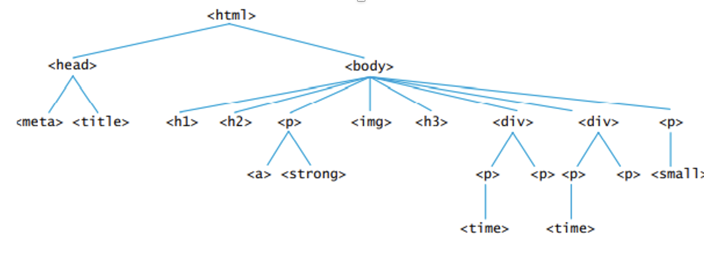

## vender prefixes
- Some browsers want to add new CSS properties that are not part of the formal CSS language.
- To achieve this, they add their own prefixes on the property.  For Chrome and Safari, it’s ‘-webkit’, for Firefox, it’s ‘-moz-’, for IE it’s ‘-ms’, and for Opera it’s ‘-o-’.
- browser companies to have more say over the CSS standard than the W3C.  This can cause long-term compatibility issues.

```css
-webkit-box-sizing: border-box;
box-sizing: border-box;
```

## SELECTORS
- These selectors can be ids, classes, or general tags
- Any part of an HTML document can be connected with a selector
- When picking the name of a custom selector, it’s very important to make sure it is unique, so that it does not confuse with selectors of imported libraries like boostrap or jquery ui.

### ELEMENT SELECTORS
- Element selectors are used to select existing HTML tags.
- This includes generic tags like \<h1>, \<body>, \<strong>…etc.

```css
h1 {
  font-size: 18pt;
  font-weight: bold;
  }
```
in this case, every \<h1> will have the style apply to it.
### CLASS SELECTORS
- The Class selector matches the class name of the style to the class name listed on the attribute of the HTML tags.
- The class selector is defined with a period(.) sign in the CSS.
```html
<style>
  .first{
    font-style: italic;
  }
  </style>
<h1 class="first">render by the css</h1>
```

### Id Selectors
- The Id selector is very similar to class selectors, but they are used to target one single specific tag, instead of a collection of tags.  
- Although most browsers are forgiving, 2 HTML tags should never have the same id attribute.
- The id selector is defined with a pound(#) sign in the CSS.
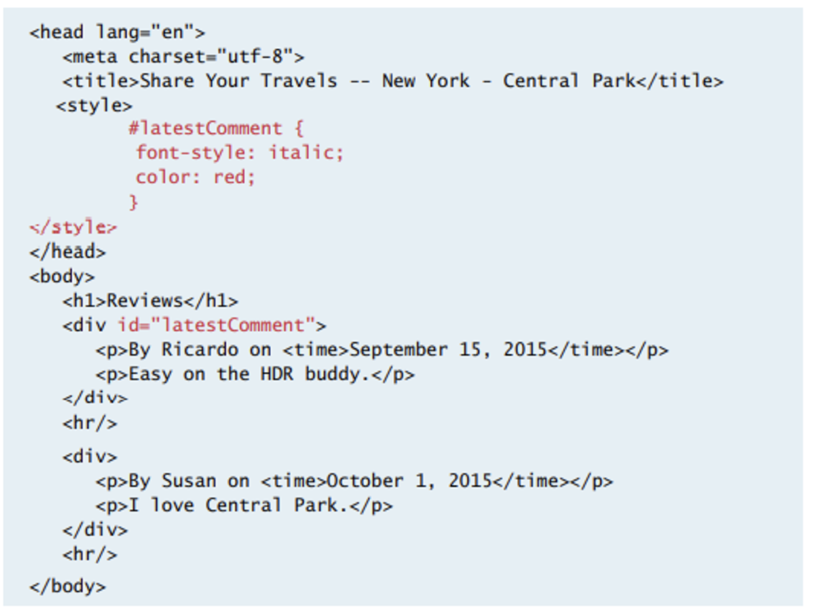

### ATTRIBUTE SELECTORS
- The attribute selector provides a way to select HTML elements by the presence or value of an attribute.  They can match any element with a ‘title’ attribute.
- id selector is defined with [].
- they are not used very often since it is not supported by every browser.
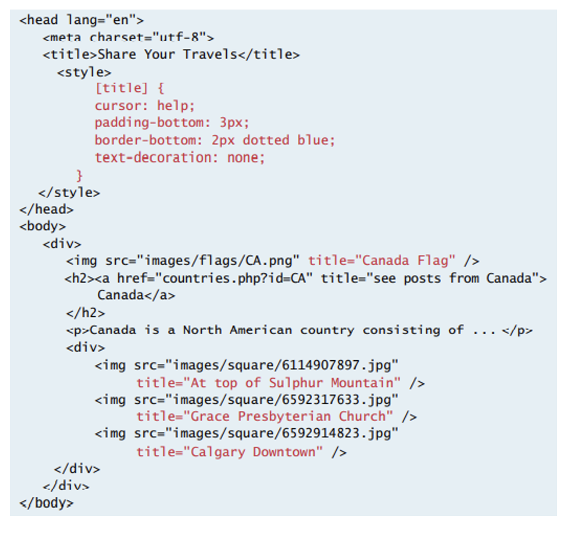
#### Attribute selectors render
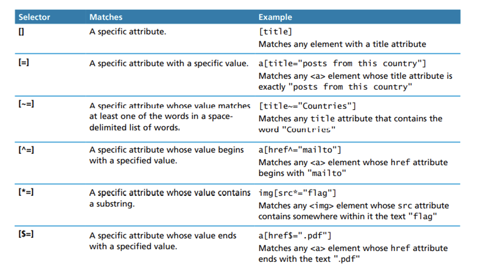

### PSEUDO-ELEMENT SELECTORS
- The pseudo-element selector is added to a master selector to change HTML elements on runtime. 
- Pseudo-element selectors require the colon :  to separate the master selector and the pseudo-class element.
- Pseudo-element selectors do not bind by a hard-coded selector, they can bind by user events or DOM locations amongst many others.
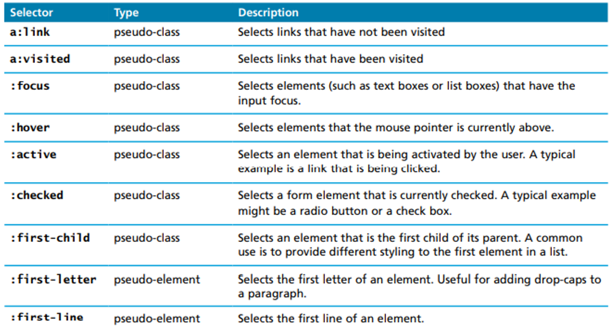

### CONTEXTUAL/DESCENDENT SELECTORS
- CONTEXTUAL / DESCENDENT SELECTORS
- They can be used to traverse to a parent, child, or sibling.
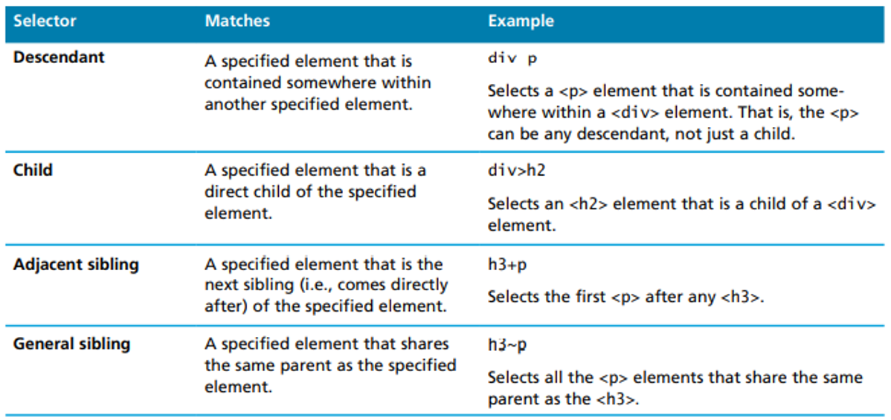
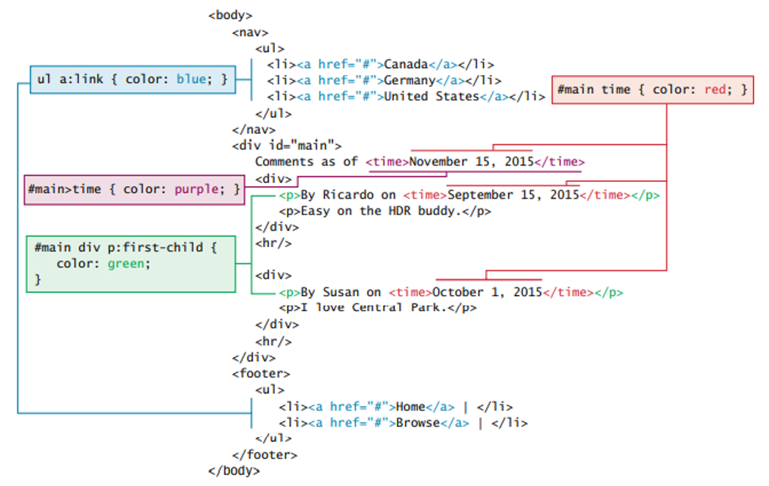

#### desendent combinator 
The descendant selector recursively selects all children of a parent element.
```css
div p{
}
```

#### child combinator 
The child selector selects only 1 layer of children of parent element.
```css
div>p{
}
```

#### adjacent combinator
The adjacent sibling selector is used to select an element that is directly after another specific element.
```css
div+p{
}
```
#### general combiantor
```css
div~p{
}
```

### grouping 
- CSS styles can be applied to multiple selectors by using a comma.
```css
h2,h3,h4 {
  font-size: 18pt;
  font-weight: bold;
  }
```

## THE CASCADE
- One of the common issues with CSS is that some styles will often overlay another.  There may be a tag linked to several different style sheets, that has a style linked to its class, and another style linked to its id.
- The ‘cascade’ in cascading style sheets(CSS) is the idea of resolving these conflicting styles by reviewing the location of elements in the DOM.

### inheritence 
- Some CSS properties like **font, color, list, and text** are inheritable, meaning descendant tags will inherit those properties.
- Other CSS properties like **layout, sizing, border, background, and spacing** are not.  Meaning their styles will apply to their element only.
- It’s possible to make styles inherited by using the ‘inherit’ value.
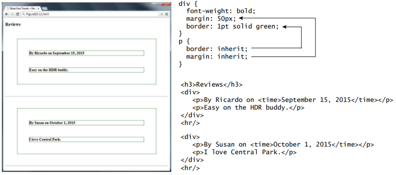
- grouping can be used to take the place of inheritence.
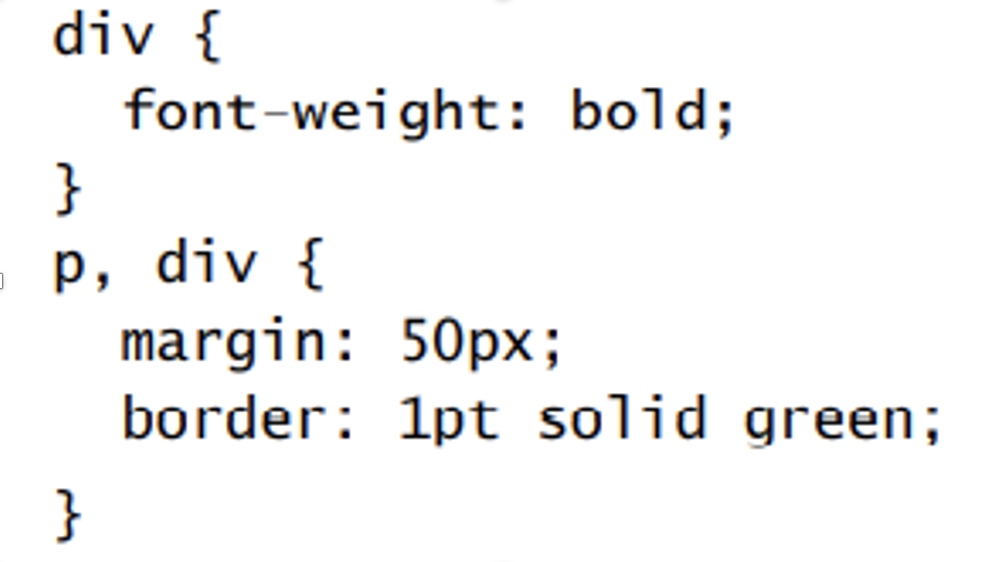

### specificity 
- Specificity is the process of determining style precedence when more than one style is applied to an element.
- The more specific the selector, the more precedence it has.
- In general, nodes that are lower in the DOM(more child) have higher say than more generic parent nodes.
- Also, class selectors have precedence over element selectors and id selectors have precedence over class selectors.
- An inline style will override an embedded style and an embedded style will override an external style.

### !important
- If the web master wants a CSS tag to override any existing style, regardless of their location or selector, they can use the !important syntax.
- this is often seen as not natural and not encouraged
```css
.someclass{
  color: blue !important;
}
```

## THE BOX MODEL
- In CSS, all HTML elements exist within an element box.
- Every style defined will apply to each of these boxes.
- Boxes are often referred to as containers in web development.
 
### BACKGROUND STYLE
- Background styles are used to define how the background will look on the box elements.
- This can be defined with colors or images.
```css
background-repeat: repeat/no-repeat/repeat-y/repeat-x
```

### BORDERS
- Borders provide a way to visually separate elements.
- You can set borders around all four sides of an element.
- the order of the property is important:border-style, boarder width, boarder color

### MARGINS AND PADDING
- Margins and padding are essential for adding white space to a web page, they help differentiate one element from another.
- Margin adds space outside an element and padding adds space inside an element, and borders divide the margin area from the padding area.

### VERTICAL MARGIN COLLAPSE
- The adjoining margins of 2 or more boxes can combine to form a single collapsed margin.
- When a collapse occurs, only the largest value is displayed, while the smaller margin is collapsed to zero.
- Horizontal margins never collapse.
- This collapsing phenomenon has been the source of headaches for many web masters troubleshooting CSS.
 
### DIRECTIONAL STYLES
- Borders, margins, and paddings can either be styled to each direction specifically or styled to all 4 directions at once as shown below.
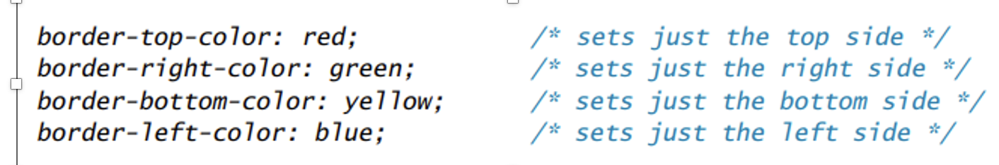
- Another way to define all 4 sides in one line is by listing each value separated by a space.
- CSS will take all 4 arguments and run them clock-wise from top, right, bottom, and left.
- If only 2 arguments are provided, the 1st argument will apply to the top and bottom border, and the 2nd argument will apply to the left and right border.
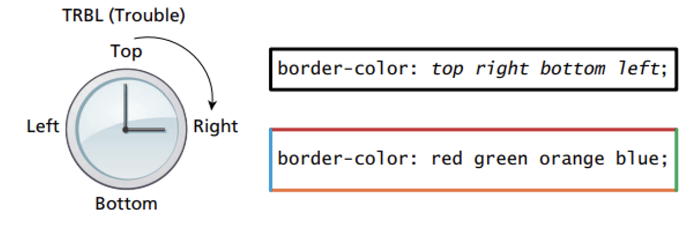

### BOX DIMENSIONS
- The sizes of each element box can be defined specifically.
- By default, the size of the box is determined by the size of its content plus its padding.
- These values can be overwritten with specific width and height values.The style box-sizing can be used to eliminate the border width from the box dimensions.

### COLORS
- Colors can also be defined using the name of the color.
- The color must be spelled exactly to the documentation.
- An example syntax would be ```<span style=‘color: red’></span>```

### OVERFLOW
- The overflow property is used to easily display elements that are too large to fit in their containers.  This is achieved by adding scrollbars.
- Scrollbars can be hand customized as well using specialized CSS.
- to show scrollbars, use ```overflow: auto; overflow: scroll```

### TEXT FONT
Browser fonts can read from user desktop computers or from an external link.
If a font doesn’t exist, it is important to define a backup one using a web font stack.  These alternatives are all separated by commas
```css
p{ font-family: Cambria, Georgia, "Time New Roman"}
```
### FONT-FACE
Importing external fonts can be done by inserting the link directly on the page or by using the font-face selector as shown.
Some of the common font sources are google web fonts and font squirrels.

### TEXT SIZE
- A font size of 12pt =  1/6 of an inch when printed.
- A font size of 72pt = 1inch when printed.
- Pixel to inch ratios do not always correlate the same depending on the pixel density of the device used.  This is why em and percentage units are better for font sizing.
- The em property is relative to their parent elements, whereas rem is relative to the size of the root element.

### POSITIONING
#### PERCENTAGES
Sizes can be determined with pixels or percentages.
Percentages are relative to the size of the parent element.
The purpose of using percentages is to make apps scalable and responsive to the browser device.
Expanding these values can sometimes cause scaling issues that are often controlled with min-width, min-height, max-width, and max-height.
> em is the font size ratio to the parent font. 1 em = 1* the size of the parent font.
> rem is the font size ratio to the root font, which is the font of \<html>

#### NORMAL FLOW
The concept of normal flow refers to how block-level and inline elements display from left to right and from top to bottom

#### POSITIONING
Positioning is used to move containers around a page.
This is done using absolute, fixed, relative, or static positioning.
Relative and static are encouraged because they are more responsive.
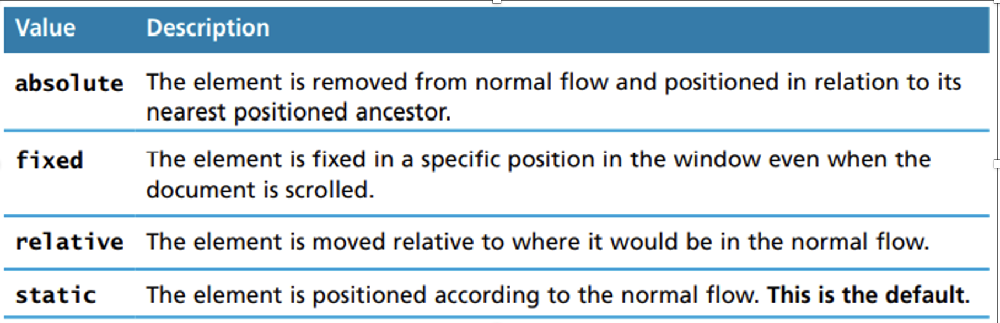
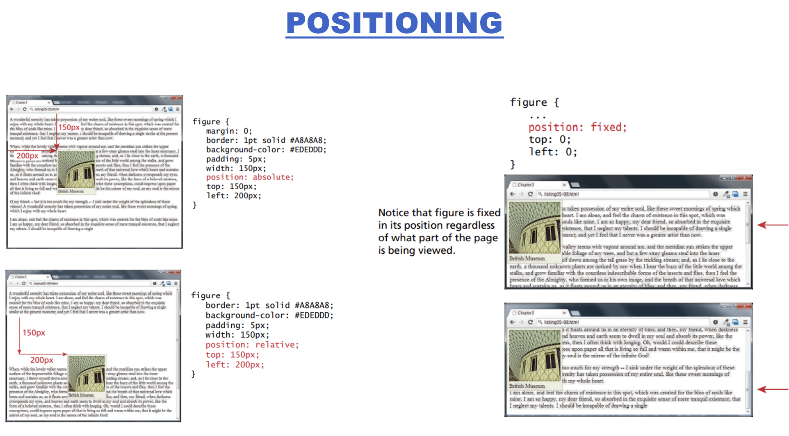

#### Z-INDEX
The z-index is used to specify the order at which an element is overlaid on a page.
The higher the z-index, the farther front the element is displayed.
The lower the z-index, the farther back the element is displayed.

#### floating
The floating element is used to displace containers out of their flow.
When floating, it is important to set a width, otherwise it will take the entire width of the window.
- floating places an element on the left or right side of its container, allowing text and inline elements to wrap around it. 

##### FLOAT CONTAINMENT
When an element is floated within a containing block, the containing block disappears.
In the example shown, a \<figure> containing block contains only an \ and \<figcaption> element, and both are floated to the left. Thus, the containning block will be down to zero
> to solve this issue, the overflow property is often set to auto. The clearfix property is also used to fix similar containment issues.

##### problem
One of the issues with floats is when a page is resized, the elements tend to shuffle, instead of staying in order. This can cause a messy layout.
 
#### CLEAR
The clear property is used to properly align elements when resizing.
The class is assigned to the element that will likely start on a new line
used to start a new line

#### DISPLAY VS VISIBILITY
Elements can be hidden using the display and visibility properties.
The only difference is that the visibility property will maintain the state of its positioning context, i.e. its parent element.
 
#### RESPONSIVE DESIGN
As described previously, CSS also must use responsive design to adapt to multiple screen sizes.
It is best to use liquid layouts(ex: calc(100%)) instead of a fixed layout(ex: width: 960px) for proper responsive design.
 
##### RESPONSIVE LAYOUTS vs liquid layouts
Responsive layouts are similar to liquid layouts but they can scale images down when the page shrinks.
Liquid layouts only scale down widths of containers.
RESPONSIVE LAYOUTS means some elements in the block may reduce its size when the browser shrinks. While liquid layouts will always maintain a specific ratio.

#### VIEWPORTS
Viewports are used to define the size of the page by the size of the device.
By using this, no scaling is required.

#### MEDIA QUERIES
A media query is used to apply styles based on the device it is displayed on.
These queries can be used to determine the capabilities of the device, and define CSS styles to target that device.
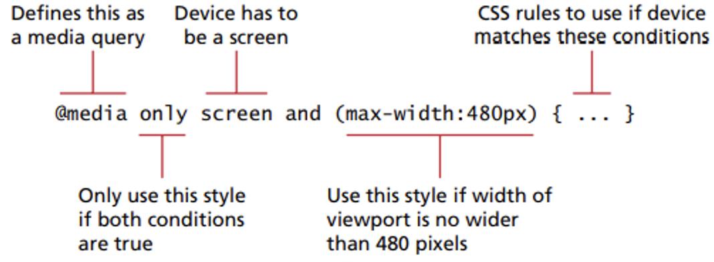

## other 
### CSS FRAMEWORKS
Large companies have relied on frameworks to make CSS layouts more consistent.
A CSS framework consists of classes and tools to make CSS work easier.  They have 2 main types: (1)grid systems and (2)CSS preprocessors.
The most popular frameworks are bootstrap, blueprint, and 960.
Bootstrap is the most popular one and was created by the designers of Twitter.  It provides styles for grids, buttons, dropdowns, and many more.

### CSS PREPROCESSORS
A CSS preprocessor is a tool that adds logic to CSS.  It adds programming concepts like variables, inheritance, calculations, and functions.
The problem with CSS is that a lot of styles are hard-coded, and when changes are required, maintainability is not easy.
By using variables and nesting, making an application-wide style change becomes an instant modification.
Some examples include SASS and SCSS.  They add more features to CSS like variables and nesting.

### ICONS
To insert an icon, the webmaster can add the following syntax to their page ```<i class=‘fa fa-fw fa-pencil’></i>.```

### troubleshoot
use elements/layout in browser to troubleshoot


