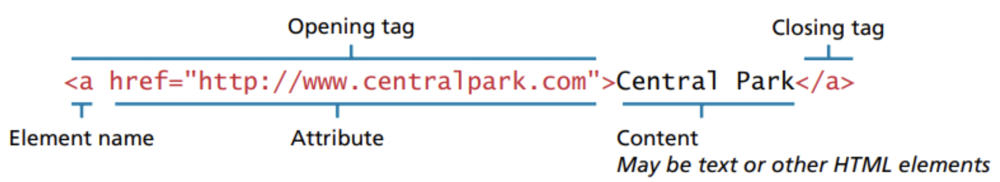
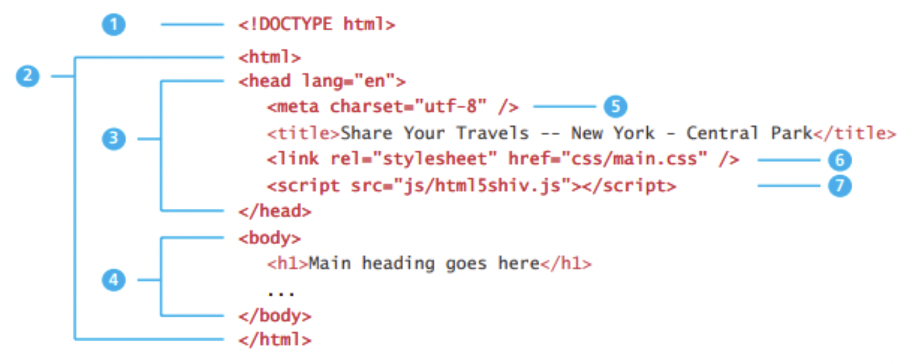
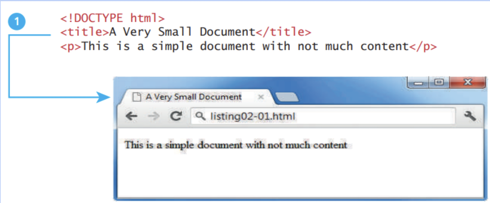
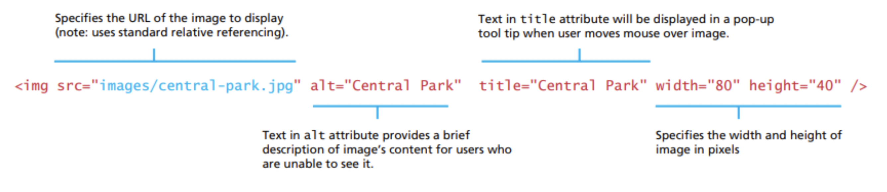
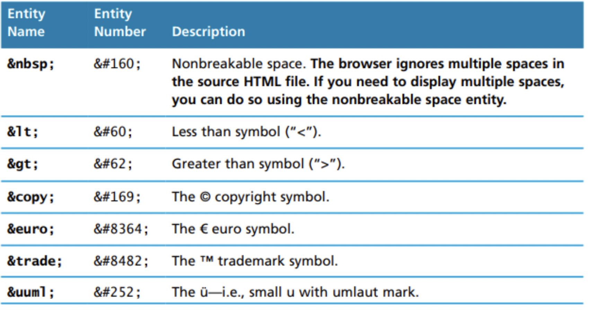
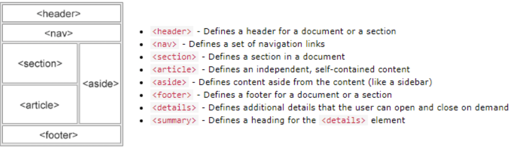
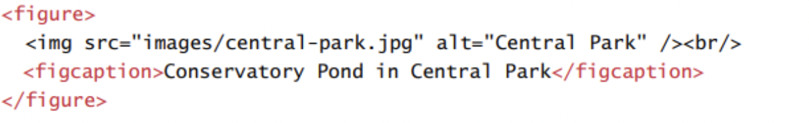
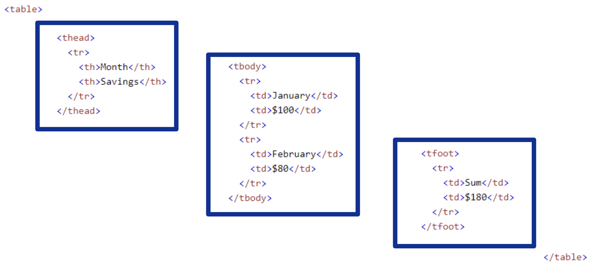
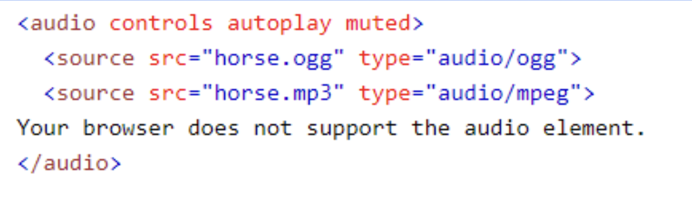

# html

## background
1. HTML is defined as a markup language.  A markup language allows users to control how text and visual elements are laid out on a document.
2. Markup language uses content and tags to display information on a page.  The content is the text in it’s raw state and the tags adds the formatting.
3. 
## xhtml
stricter version of HTML developed by W3C in the 1990s to provide better long-term results in web development. Html can be sloppy which allow code with syntax errors. This caused browsers to be unpredictable when handling errors.          
There are 2 versions of XHTML that were created were XHTML 1.0 Strict and XHTML 1.0 Transitional.  The transitional version was more lenient.

### xhtml vs. html.      
1. \<!DOCTYPE> is mandatory.       
2. The xhtml attribute in \<html> is mandatory.         
3. \<html>, \<head>, \<title>, and \<body> are mandatory.       
4. Elements must always be properly nested.
5. Elements must always be closed.
6. Elements must always be in lowercase.
7. Attribute names must always be in lowercase.
8. Attribute values must always be quoted.
9. Attribute minimization is forbidden.

## xml
XML is weighter and more general than HTML. It’s used to mark up any data such as schemas, file format documents, and rss data.   
## grammar
The rules of XML are that there is a single root element, tag names are composed of any valid characters, tag names do not start with a number, tag names and attributes are case sensitive, attributes must be within quotes, and all tags must have a closing tag.
## html syntax
1. Content is wrapped in tags, that contain attributes, as shown below.
2. Attributes are name value pairs that specifies information about the tag.  The value must be wrapped in quotes.
e.g{.align-center}
  
## tag and attributes
1. Attributes are specifications that can be added to each HTML tag so they behave certain ways.
2. W3C recommends that all attributes be written in lower case and values be quoted.
{.align-left}
3. Single and double quotes can be used interchangeably to display actual quotes vs defining attribute values. But you can use two double quotes or single quotes which nests each other.

### comment
1. should always be included on top of a section of code.

```html
<!--<h1>this is a comment</h1>-->
```
### DOCTYPE
The document type definition (DOCTYPE) tells the browser the type of document to process.
```html
<!DOCTYPE html>
```
### HEAD AND BODY
1. The \<html> tag is sometimes called the root because it wraps all other tags in the document but is mainly divided between the head and body tags. 
2. HTML5 does not require the \<html>, \<head>, and \<body> tags but XHTML requires them.


#### Head
The head contains content about the document, such as title, style sheets, and JavaScript files.  
1. Specifies the external CSS sheet that used in the document.
2. Specifies an external JavaScript file.
```html
<link rel="foo" href="bar.com/1.css" />
<script src="js/1.js"></script>
```
##### TITLE TAG
1. The \<title> tag is used to display the label of a page.
2. The browser uses the title tag for its bookmarks and browser history.
3. The operating system might also use it for the windows taskbar.
4. Search engines use the title tag as the linked text to their search engine result pages.

```html
<title>this is a title</title>
```

##### CHARSETS
used by web browsers to know which character encoder should be used to display the page properly
```html
<meta charset="UTF-8"/>
```
#### Body
The body contains content that will be displayed by the browser.

##### BLOCK + INLINE
1. Block elements carriage-return on each tag.
2. Inline elements stay on the same line.

#### H TAGS
1. Heading tags (h1, h2, h3…) are used to display different sized text.
2. These tags are not used often anymore because their format can be replaced with CSS.
3. Using these sorts of default h tags can sometimes be hard to work with, because they contain hidden margins and spaces that are hard to control.
```html
<h1>this is a h tag</h1>
```

#### P TAGS
1. The \<p> tag is wrapped around text to define a paragraph.
2. The \<br/> tag is used by itself and used to force a line break.


#### DIV + SPAN TAGS
1. The \<div> tag and the \<span> tag are the most common HTML tags, and are used as generic containers for anythin.   
2. The \<span> tag is usually preferred because it is inline and liter weight than the div tag.  The \<div> tag is block-level.

#### A TAGS
1. the \<a> tag aka the anchor tag is used to define a hyperlink
2. When first testing an anchor tag, it is common to set the href as href=‘#’.  
```html
  <a href="foo.com">this is an anchor</a>
```
 
#### Img Tag
 {.align-left}

#### Entitles
1. The \&lt; and \&gt; is highly encouraged because otherwise if \<\\> is used on a value, it can cause the browser to confuse it for a tag and render incorrectly.


                                                                     
#### Emojis
Emojis look like images and icons but they are not, they are letters from the UTF-8 character set \<meta charset="UTF-8">.
  
#### list
1. Unordered lists are added using the \<ul> tag and contain bulletin points.
2. Ordered lists are added using the \<ol> and contain numbers.
3. The \<li> tag is inserted for each item of the list.

#### Layout

                                                         
#### HEADING GROUPS
The \<hgroup> tag can be used to group \<h> elements together, but it is dropped by w3c and is replaced by \<div>
  
#### Figure
1. Figures can be added using the \<figure> tag.
2. A figure caption can be added using the \<figcaption> tag.
  

#### ASIDES
The \<aside> tag does not render as anything, but can be used with css to render side notes.
  
#### IFRAMES
1. The \<iframe> tag is used to display a web page inside another web page.
2. They are useful for advertisements on web pages, because they give isolated third party security and scripting.

#### other tags
1. The \<hr> tag creates a line across the page.
2. The \<code> tag displays the content in a programming font.
  
### TABLES
1. tables should be defined with \<table> \<\tables>
2. caption can be added with \<caption>
3. table row = \<tr>
4. table header = \<th>
5. table column = \<th>
6. columnspan can be used so that a cell occupied more than one column in \<td> and \<th>
7. rowspan can be used so that a cell occupied more than one row in \<td> and \<th>
```html
<th columnspan="2">a cell occpuied 1 row and 2 column space</th>
<td rowspan="2">a cell occpuied 1 column and 2 row space</td>
```
8. table > tr>th>=td
#### THEAD AND TBODY
1. Although not required, it is common practice to wrap the header row in a \<thead> tag and the content row(s) in a \<tbody> tag.
2. t is good practice to include them because they perform better on standard table functions like scrolling, sorting, and DOM manipulation.

3. thead>tfoot>tbody
## media
### colorsyntax
```css
.rectangleA{
	background-color: rgb(0,255,0);
}

.rectangleB{
	background-color: green;
	opacity: 0.75;
}

.rectangleC{
	 rgba(0,255,0,0.5); <!--red,green,blue,opacity-->
}
.rectangleD{
	 hsla(100,255,0%,50%.5); <!--hue, saturation, lum, opacity-->
}
```
#### RGB VS CMYK
1. RGB is used by computer monitors because the full spectrum of colors using lights can be presented with the red green and blue colors.
2. CMYK is used by computer monitors because the full spectrum of colors using printers can be presented with the cyan, magenta, and yellow colors.
3. Printed photos will rarely look the same as photos on screen, because RGB and CMYK have different color gamuts, i.e. different range of colors to display.

#### HSL
1. HSL uses hue, saturation, and lightness to represent colors.
2. HSL was mainly invented because it closely relates to how we describe colors in the real world.  We often describe colors as ‘a bright rich green’, instead of ‘a #33CA8F’ color.

### OPACITY
1. Opacity describes the transparency of a color.
2. Opacity typically is a number between 0 and 1, 1 having zero transparency.

### Color Depth
1. 8 bits or less is called index color. 
2. 24 bits called true color. 8 bits each for red, green, and blue

### resize
1. Resizing an image will always degrade it’s quality, because the program has to interpolate or re-calculate the location of colors on each pixel.
2. Enlarging an image reduces quality much more than shrinking.

### RASTER VS VECTOR
1. A raster image has a collection of hard-coded colored squares/pixels with an assigned number to it.
2. A vector image is not composed of pixels, but instead of objects such as lines, circles, bezier curves, and polygons. 
3. he main advantage of vector is that they are resolution independent but the main advantage of raster is that they display photos better

### Image Format
#### JPEG
1. Joint photographic experts group(JPG) is a 24-bit, true-color, and it uses losing compression

#### GIF
1. 8bits, and lossless compression

#### PNG
1. best size to quality ratio 
2. a transparency map that can be used for compositing.

#### svf 
1. Scalable Vector Graphics(SVG) are vector format images 
2. xml format

### VIDEO
1. videos can be added using the \<video> tag.
2. The ‘controls’ attribute adds video controls, like play, pause, and volume.
3. The ‘autoplay’ attribute plays the video automatically on start.
4. The ‘muted’ attribute plays the video muted by default.
5. The ‘loop’ attribute replays the video over and over again.
6. The width and height attributes set the size of the video.  The page may flicker if those are not set.
7. The source element is used to define the location attributes of the video.
8. The text between the \<video> tags will only display in browsers that do not support the video element.

### AUDIO
1. Similar to the video syntax, audio can be added using the \<audio> tag.
2. The controls attribute adds controls like play, pause, and volume.
3. The \<source> element specifies a list of links that the browser can use to play the audio.  The browser will start with the top link first.
4. The text between the \<audio> tags will only display if the browsers do not support the \<audio> element.
5. The autoplay and muted attributes work just like the video attributes.


### OBJECT
1. The \<object> tag is used to import any generic media item.
2. These items can include java applets, pdf readers, or flash players.
3. The \<embed> tag can be used to import HTML into another HTML document.


### CANVAS
1. Canvas is used to draw 2 dimensional shapes on the browser.
2. Canvas is very powerful, and has the ability to draw and animate all sorts of designs.


