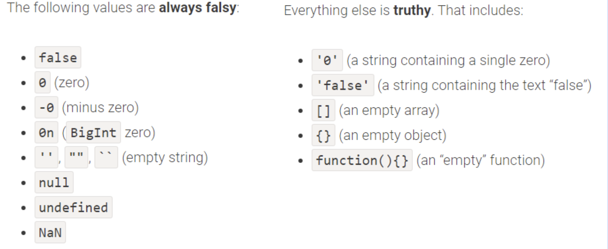
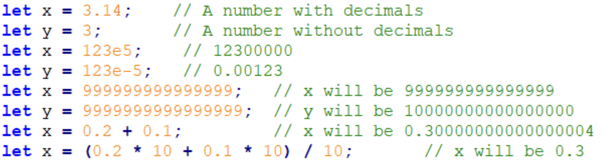
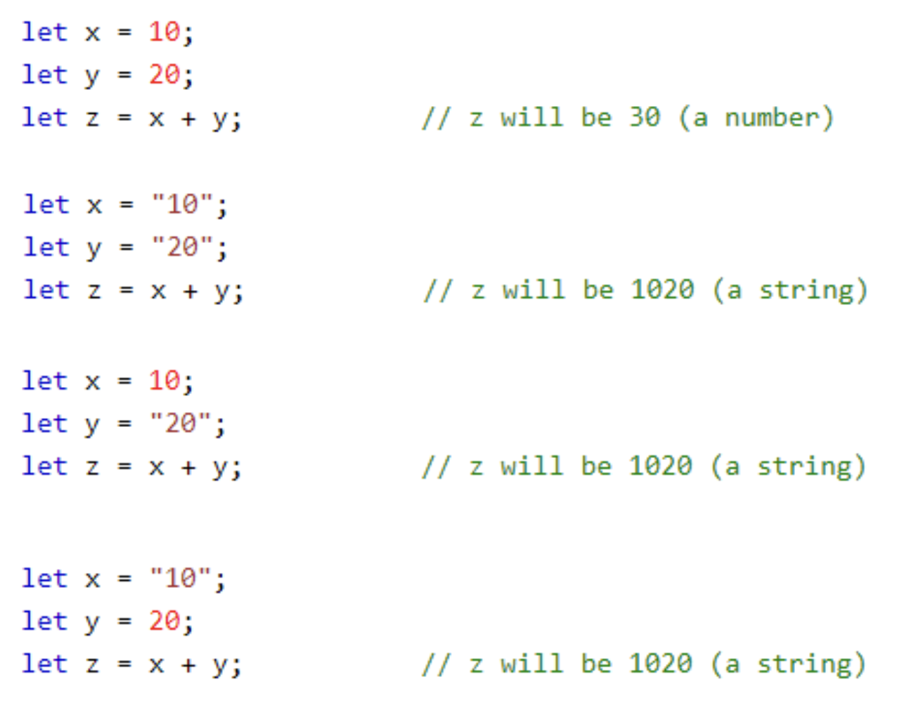
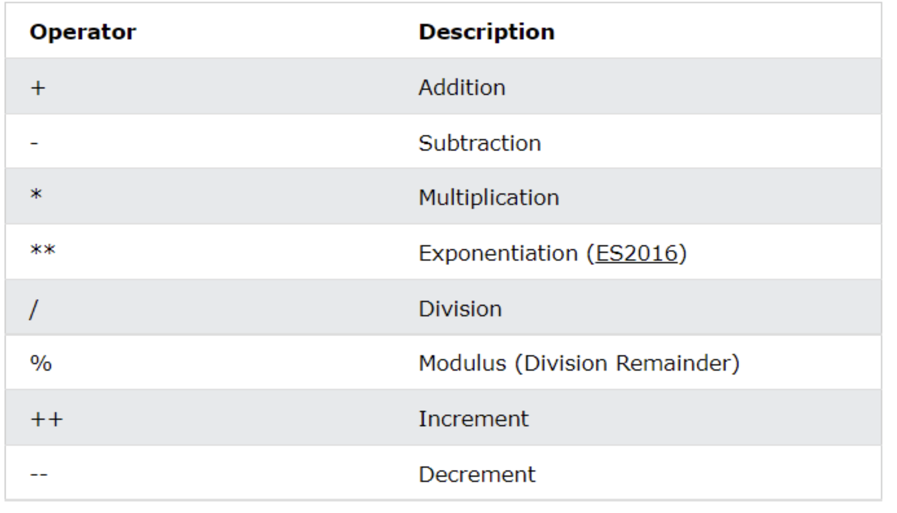
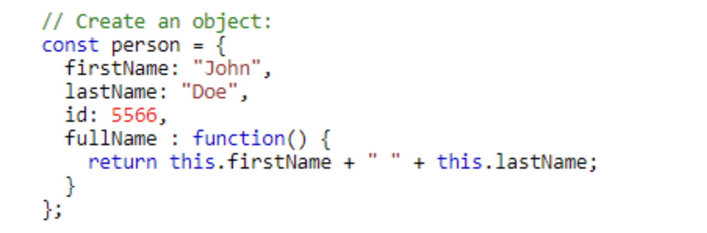
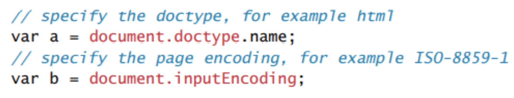
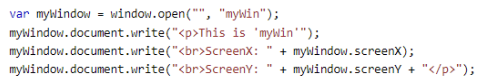

# Javascript
- JavaScript is the preferred language for client-side scripting of web pages.
- JavaScript can programmatically access and alter HTML elements and change a web site dynamically.
- JavaScript can animate, move, transition, hide, and show parts of a page instead of refresh the entire page.
- JavaScript is object-oriented, dynamically/weakly typed(variables easily converted from one to another), lightweight, scripting language.
- JavaScript is very different from Java.
- JavaScript  uses objects that have constructors, properties, and methods.
- JavaScript is dynamically instead of statically typed, meaning type checking is done at run-time instead of compile-time.


## client sides script pros and cons
### pros
- Reduces the load from the server computers.
- Browser can respond to user events faster.
- JavaScript can interact with HTML in ways that servers can’t.

### cons
- No guarantee that client computer has JavaScript enabled.
- Client computers may be unpredictable depending on the operating systems, programs, configs, and browsers used.
- Web development can be difficult because of the added interactions of different languages that have to interact properly to display a web page.

## LOCATIONS
- Similar to CSS, Javascript can be inline, embedded, or external.
- It is preferred not to use inline JavaScript because of maintainability and performance reasons.

### INLINE
```html
<a href = "JavaScript:OpenWindow();">more info<a/>
<input type="button" onclick="alert('Are you sure');" />
```

### EMBEDDED
- Embedded injection is by adding Javascript inside a \<script> tag inside the .html file.
- The location of this tag is very important, because if some scripts rely on previously declared variables, the page will not run if this tag is placed before those variables are declared.
- This \<script> tag can be placed inside the <head> or <body> tags.
```html
<script type="text/javascript">
/* a js comment*/
alert ("Hello World");
</script>
```

### external script
- External injection is by importing JavaScript through a separate file.
- enternal custom Javascript files can be imported as well as libraries hosted on the internet such as JQuery.js, Moment.js, and Toastr.js.
```html
<head>
    <script type="text/JavaScript" src="greeting.js">
    </script>
</head>
```

### comments
- in-line comments are applied with //
- mult-line comments are applied with /**/


## variable
- in js, variable are dynamically typed, meaning they are called out with a wild card reserved term like 'var','let' or 'const', but their type can change from objects, arrays, ...etc
- no variable should be re-declared after it's delcared
```
var x;
var y =0;
y = 4
```

## scope
the scope of let is block-wide
```js
{
    let x =2
}
x =3; //this is illegal, due it is out of scope of the decoratio;
```

the scope of var however, is global.

```js
{
    var x =2;
}
x =3; //this is legal;
```

```js
{
    const x =2;
}
x =2; //this is illegal; due to scope reason
```

## variable declaration
since 2015, use of ```var``` is replaced with ```let```, due to scope reason;   
declare with "const" is also available, but the value of a const cannot be changed after it's declaration;  

## variable group
- in js, we can declare variable in group
```js
let a,b,c;
const d=2,e=3;
```

## VARIABLE SYNTAX
- Numbers can be written with or without decimals.
- Strings can be written with **double dashes or single dashes**.
- The = sign is used to assign values to variables.
- Arithmetic operators like +  - * / can used to do math on values.

## VARIABLE NOMENCLATURE LIMITATIONS
- the first character must a letter or an underline. you cannot use number as the first letter of a variable name 
- The rest of the variable name can include any letter, any number, or the underscore. You can't use any other characters, including spaces, symbols, and punctuation marks.
- case sensitive
- no limit on the length of the variable name
- no reserve words

##  HOISTING
- Hoisting is the process of allowing a programmer to declare variables anywhere in the code and will still work even if they are used before they are called.
- The ‘var’ callout can be declared anywhere because of hoisting but the ‘let’ and ‘const’ callout must be declared before used.

## NULL + UNDEFINED + NAN
- Null: a variable is declared and assigned a value of null but means nothing.  Null is also an object but as opposed to standard objects, null objects return falsy.
- Undefined: a var that is declared but not defined
- NaN: a var is not a number

## utility method
### TYPEOF
- The ‘typeof’ operator can be used to find the type of a variable.
- typeof doesnt work on array, use Array.isArray instead.

### ISNAN
- check if a value is "not a number"
```
isNaN("hello")=true;
isNaN(1)=false;

```

### TRUTHY / FALSY
- Truthy/Falsy logic is very helpful when doing logic in JavaScript.
- instead of writing if(a != null && a!= undefined) you can just write if(!a) and does the same logic thanks to truthy/falsy logic.

- to evaluate truthy and falsy, we can use
```js
let a=0;
Boolean(a);
!!a;
```

## STRINGS
- The string class is used to defined arrays of chars.
```js
let a=new String("good");
let a="good";

```

### concatenated
- Using the `` tick notation came out in 2015 per the ES6 notation and is often used in development because it eases the process of concatenating strings with variables.

```js
var str = a.concat("Morning");
var str = a +"Morning";
var str = `${str}+Morning`;


let space=' ';
let a = "a"+space+"b";
let b =`a+${space}+b`;
```

### other string methods
#### slice()
- slice() extracts a part of a string and returns the extracted part in a new string.

- The method takes 2 parameters: the start position, and the end position (end not included).
```js
let str = "Apple, Banana, Kiwi";
let part = str.slice(7, 13);

//if the index is a negative number, the slice will be backwards.
```

#### substring()
- substring() is similar to slice().

- The difference is that start and end values less than 0 are treated as 0 in substring().

- If you omit the second parameter, substring() will slice out the rest of the string.

#### substr()
- substr() is similar to slice().

- The difference is that the second parameter specifies the length of the extracted part.

#### replace()
- replace the first matched pattern with the second parameter.
- f you want to replace all matches, use a regular expression with the /g flag set.
- The replace() method returns a new string. instead of change the given one.
```js
let text = "Please visit Microsoft and Microsoft!";
let newText = text.replace("Microsoft", "W3Schools");
```

#### toUpperCase()&&toLowerCase()
```js
let text1 = "Hello World!";
let text2 = text1.toUpperCase();
let text3 = text1.toLowerCase(); 
```

#### concat()
- concat() joins two or more strings:
```js
let text1 = "Hello";
let text2 = "World";
let text3 = text1.concat(" ", text2);
```

#### trim()
- The trim() method removes whitespace from both sides of a string:
```js
let text1 = "      Hello World!      ";
let text2 = text1.trim();
```

####  padStart()&&padEnd()
- The padStart() method pads a string with another string:
```js
let text = "5";
let padded = text.padStart(4,"x");
> xxx5
let padded = text.padEnd(3,"c");
> 5cc
```

#### charAt()&charCodeAt()
- The charAt() method returns the character at a specified index (position) in a string
- The charCodeAt() method returns the unicode of the character at a specified index in a string:

#### split()
- A string can be converted to an array with the split() method:
```js
let text = "a,b,c,d,e,f";
const myArray = text.split(",");
> myArray = {a b c d e f}
```

## NUMBERS



### arithmetic

```
^ is xor
| is or 
```

## OBJECTS
### OBJECT ORIENTED PROGRAMMING
- Javascript is not a fully OOP program because it doesn’t use inheritance and polymorphism to the extent of other OOP programs like Java and C++
- However, it does use the object structure extensively, using constructors, properties, and methods.

### JSON
- JavaScript Object Notation(JSON) is the most common way to define JavaScript structures.
- Object keys are not limited to variable notation, they are similar to strings, they can include spaces, start with numbers,…etc.

### INITS
- Every data structure in JavaScript(whether array, boolean, date, math, string, object,…etc.) requires a constructor to initialize them.
- These initializations can be defined in different ways.

```js
var someObject= new ObjectName(para1, para2, para3);
```

### PROPERTIES
- Properties are defined with dot notation that separates the instance with the property.

### METHODS
- Objects can also have methods assigned to them.
- These functions will run whenever they are called using the same dot notation used to call properties.


### DOCUMENT OBJECT MODEL(DOM)
- According to the W3C, the DOM is a platform and language neutral interface that allows programs and scripts to dynamically access and update the content, structure, and style of documents.
- the root of a DOM is document tag

### DOCUMENT OBJECT
- The document object is the root JavaScript object representing the entire HTML document.
- It includes some information about the page including docType and inputEncoding.


### BROWSER OBJECT MODEL(BOM)
- The BOM is similar to the DOM, but includes a bunch of objects that are accessible within a browser.
- This includes history, screen, navigator, and location objects.

