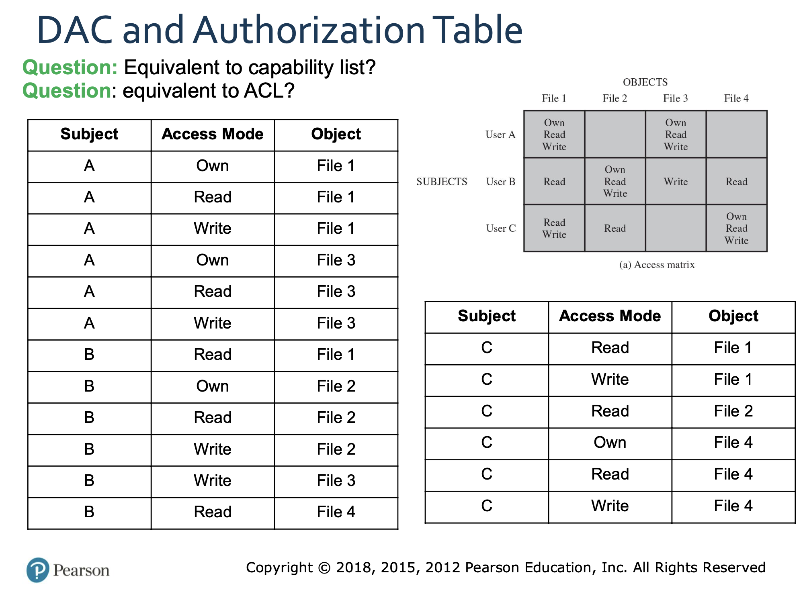

# Access Control
## Access Control Matrix Model
### Relationship Among Access Control and Other Security Functions
An access control mechanism mediates between a user (or a process executing on behalf of a user) and system resources, such as applications, operating systems, firewalls, routers, files, and databases. The system must first authenticate an entity seeking access. Typically, the authentication function determines whether the user permitted to access the system at all. (stalling, 141)
### protected state
- state of a system is a collection of current values of all m
  - memory locations
  - secondary storage
  - registers
  - other components of the system
- protection state is a subset of states that deal with protecting the system
- state transition is a change from one state to the next usually via a command
  - can cause change in the protection state
### type of mechanism


### Access Control Matrix
- Access Control Matrix (ACM) is a tool to describe a protection state of the system by characterizing the rights of each subject 
- Elements of an ACM form a specification against which the current  state can be compared

#### Subjects, Objects, and Access Rights
- subject: an entity who is able to access a resource
- object: a resource that can be accessed
- access right: describe how can a object be accessed by a subject

#### Miscellaneous 
- class: owner, group, world
- right: read, write, execute, search, delete, create

#### concept


### an example


## Access Controlled by History
- S set of static rights associated with procedure (i.e. each piece of “static” code)
- C set of current rights associated with each process as it executes
-  When process calls a procedure, the process rights are the interception of S and C.

### an example 
```c
function help_proc()
            return sys_kernel_file
function main()
    sys_load_file(help_proc)
    tmp_file = help_proc()
    sys_del_file(tmp_file)
```

## Protection State Transitions via Access Control Matrix (ACM)
### state transitions

- transformation procedures

### Primitive Operations
- create subject s; create object o
- destroy subject s; destroy object o
- enter r into A[s, o], delete r from A[s, o] add/remove a right


#### if condition
x is a right in A[s,o]
```
command foobar(p,s,o)
  if x in A[s,o]
  then
end
  
```
- bi-conditional
```
command foobar(p,s,o)
  if x in A[s,o] and y in A[s0,o]
  then
end
  
```
## Special Rights –Copying, owning and Principle of Attenuation of Privileg
### Attenuation of Privilege
Principle says you cannot increase your rights or give rights you do not possess
- restrict addition of rights within a system
- often ignored for the owner, since the owner can give itself the right and then give them to others, and then delete its own right.

### copy flag and right
- copy right/grant right allows possessors to giev rights to another. 
- often attached to a right or privilege (flag), so only applies to that right. 
```
r cannot be copied
rc can be copied
```
### own right
allow the possessor to change entries in ACM column. i.e. the owner can give and delete rights to others. 
- may depends on the underlying OS

## Access Control Policies
### Categories of Access Control Policies
dictates type of access permitted, under which circumstances, and by whom.
- Discretionary Access Control (DAC) –discretionary because an entity’s  access right may permit it to enable another entity to access some  resource
- Mandatory Access Control (MAC) –mandatory because an entity with  access rights to a resource may NOT enable another entity to access the  resource
- Role-based Access Control (RBAC) –user roles for access rights
- Attribute-based Access Control (ABAC) –user attributes for access  rights

### Discretionary Access Control (DAC)
Controls access based on
- identity of the requestor and
-  access rules (authorizations) stating what the requestor is permitted (or not) to do
- An entity’s access right may permit it to enable another entity to access some resource

### Decomposition of DAC’s ACM
- Access Control Lists (ACLs): decomposition by columns (objects)
- Capability tickets: decomposition by rows  (subjects)
- Authorization Table: contains one row for one  access right of one subject to one resource (can  use relational database)

### ACL
- For each object and permitted access rights
- May contain a default, or public, entry to o permit users not explicitly listed with special  rights to have a default set of rights that should  follow the Rule of Least Privilege 
- Principle of least privilege states that a subject  should be given only those privileges that it needs  in order to complete its task

### DAC
apability Lists decompose ACM by rows 
- Specifies authorized objects and operations for a 
particular user
- each user has a number of tickets and may be 
authorized to loan or give them to others 
### an example


### ACL vs DAC
Capability Lists is less safer than ACL.
- since each user may authorize to loan or give the capability ticket
- so integrity of a capability ticket must be protected and guaranteed
  
### Authorization Tables
- One row for one access right of one subject to one resource


## Mandatory Access Control
More restrictive than DAC
- Compares
  - security labels (indicate how sensitive or critical system resources are) with
  - security clearances (that indicate which system entities are eligible to access certain resources)
- Mandatory because an entity that has clearance to access a resource may not enable another entity to access that resource
- Security decisions made by a central policy administrator

## RBAC
- User to roles
- Roles to resource


### A Family of RBAC Models

-  RBAC_0 - minimal functionality for RBAC system 
- RBAC_1 includes RBAC and role hierarchies (enables one role to inherit 10 permissions form another role)
- RBAC_2 includes 𝑅𝐵𝐴𝐶 plus constraints that restrict configuration of the system
- RBAC_3 includes both hierarchies and constraints

### RBAC_1


### RBAC_2
- Provide a means of adapting RBAC to the specifics of administrative and security policies of an organization
- A defined relationship among roles or a condition related to roles
- types
  - Mutually exclusive roles
    - A user can only be assigned to one role in the set (either during a session or statically)
    - Any permission (access right) can be granted to only one role in the set

  - Cardinality
    - Setting a maximum number with respect to role
  - Prerequisite roles
    - Dictates that a user can only be assigned to a particular role if it is already assigned to some other specified role

## Attribute-Based Access Control (ABAC)
- Can define authorizations that express conditions on properties of both the resource and the subject
- Strength is its flexibility and expressive power
- Main obstacle to its adoption in real systems has been concern about the performance impact of evaluating predicates on both resource and user properties for each access
- Web services have been pioneering technologies through the introduction of the eXtensible Access Control Markup Language (XAMCL)
- Distinguishable because it controls access to objects by evaluating rules against the attributes of entities, operations, and the environment relevant to a request
- Systems are capable of enforcing DAC, RBAC, and MAC concepts

### Attributes
- Subject attributes: A subject is an active entity that causes information to flow among objects or changes the system state
  - Attributes define the identity and characteristics of the subject
  - e.g. subjects id, name, organization, job title, or even a role, etc.

- Object attributes: An object (or resource) is a passive information system-related entity containing or receiving information
  - Objects have attributes that can be leverages to make access control decisions
  - e.g., Word document attributes may be title, subject, date, atuhor

- Environment attributes: Describe the operational, technical, and even situational environment or context in which the information access occurs
  - These attributes have so far been largely ignored in most access control policies
  - e.g., current date/time, current virus/hacker activities, might be relevant in applying an access control policy

### an example


### policy
- A policy is a set of rules and relationships that govern allowable behavior within an organization, based on the privileges of subjects and how resources or objects are to be protected under which environment conditions
- Privileges represent the authorized behavior of a subject and are defined by an authority and embodied in a policy

#### more on policy


#### an example


