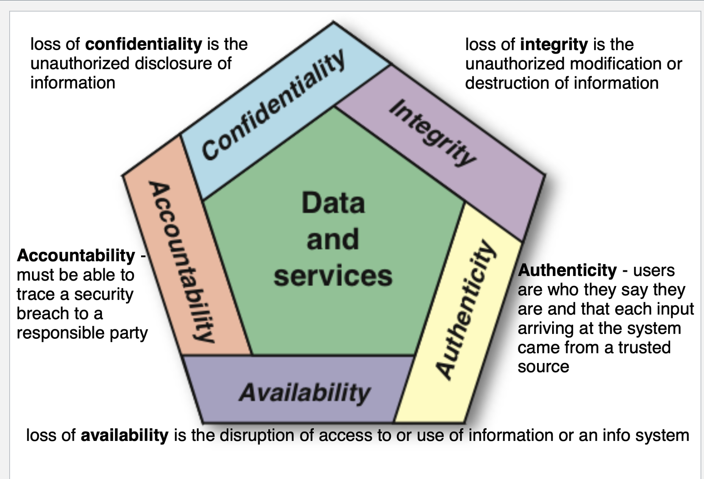
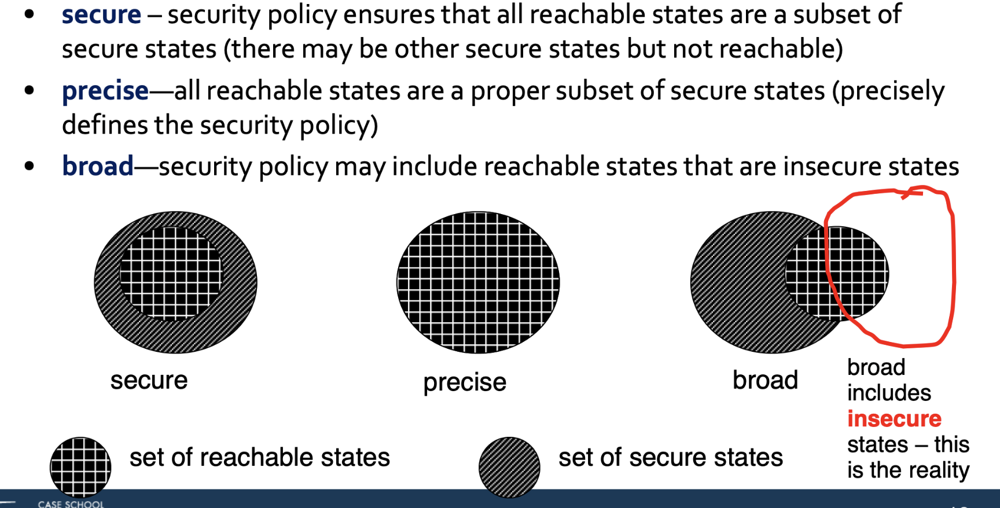

# Concept of Computer Security
Conputer security: the mesaure applied to a information system which protects its confidentiality, integrity, and integrity.
1. confidentiality: data is not disclosed to unauthorized individual. Solution: Access Control, Authorization
2. integrity: data will not be modified in an unexpected manner.     Solution: Backups, Check sum, Message auth code.
3. Availablity: Assures that systems work promptly and service is not denied to authorized users solution: Physical protections, Computational redundancies

## The devision of Security 
1. Information Security: concerned with the confidentiality, integrity and availability of data regardless of the form the data may take: electronic,print, or other forms
2. Computer security: (a.k.a. cybersecurity) the protection of computer systems 
3. Network Security: the process of taking physical and software preventative measures to protect the underlying networking infrastructure 

> network security $\subseteq$ computer security $\subseteq$ Information Security

## NIST and CIA Triad
National Institute of Standards and Technology proposed CIA Triad 

## kerckhoff‘s Principle
1. A cryptosystem should be secure even if the attacker (Oscar) knows all details about the system, with the exception of the secret key. 
2. we can not prove the security of a system. We can only try to break it repeatedly

## expand CIA Triad to five dimension

## Threat Consequences
- Disclosure unauthorized access to information
- Deception: acceptance of false data
- Disruption—interruption or prevention of correct operation
- Usurpation—unauthorized control of some part of a system; i.e. a threat to system integrity

## passive and active attack
- passive attempts to learn or make use of information from the system but does not affect system resources
- An active attack attempts to  alter system resources or  affect their operation of  some part of a system

## Security Attack: General Categories
  - Masquerading/Spoofing attack impersonation of one entity by another including: IP Address spoofing, ARP spoofing, DNS spoofing. **Disclosure and Usurpation**, **active attack**
  - Snooping/Sniffing—unauthorized interception of information. **Disclosure, passive attack**
  - Modification/Alternation: **Deception, Disruption, Usurpation, active attack**
  - Repudiation of origin **decption,active attack**
  - Denial of receipt- **Usurpation,active attack**
  - Delay **Usurpation**
  - Denial of Service **Usurpation**
  
## Security Policy 
- statement of what is, and is not, allowed
- Policies may be presented mathematically, as a list of allowed (secure) and disallowed (nonsecure) states
## Security Mechanism
-  method, tool, or procedure for enforcing a security policy 

## Assumptions and Trust
1. Security rests on **assumptions** specific to the type of security required and the environment in which it is to be deployed
2. Trust: confident expectation of something
> E.g.  Backdoor into a system-assume that this backdoor will not be used unless requested by high management

## Two Assumptions by Policy Designers
1. the policy correctly and unambiguously partitions the set of system  states into secure and nonsecure states (may not be true in reality) 
2. the security mechanisms prevent the system from entering a  nonsecure state (i.e., the security policy can be enforced by these  mechanisms)

>**incorrect and ambiguity in the policy:**
**a bank manager can transfer money between accounts.**
Can the manager transfer from anyone’s account to the managers account? 
According to the policy yes but in reality, this is embezzlement 

## Trusts on the Mechanisms
- Each mechanism implements part of the security policy 
- The union of security mechanisms implements all aspects of the security  policy 
- The mechanisms are tamperproof 
- The mechanisms are installed and administered correctly

## Mechanisms: secure, precise or broad

## Assurance
- Provide a basis of “how much” to trust a system
-  Steps for Assurance of a System
	  - Specification   
    	1.  Requirements analysis     
      2. Statement of desired functionality
    - Design: translates the specifications into components
    - Implementation: create a system that satisfies the design

## Goals of Security
- Prevention: prevent attackers from violating security policy
- Detection: detect attackers’ violation of security policy
- Recovery: Stop attack, Fault tolerance

### Prevention
1. involves implementation of mechanisms that users cannot override and  that are trusted to be implemented in a correct
2. can be cumbersome and interfere with system use

### Detection
1. detect attackers’ violation of security policy. e.g use of log file.

## Operational Issues
Security policies and mechanisms: how to balancing protection against the 
cost of designing, implementing and using the mechanism
1. Cost-Benefit Analysis: is the measure worthy.
2. Risk Analysis: Should we protect something?
3. Laws and Customs

## Attack Surfaces
Consist of the reachable and exploitable vulnerabilities in a system. 

### Attack Surface Categories
1. Network Attack Surface
2. Software Attack Surface
3. Human Attack Surface

