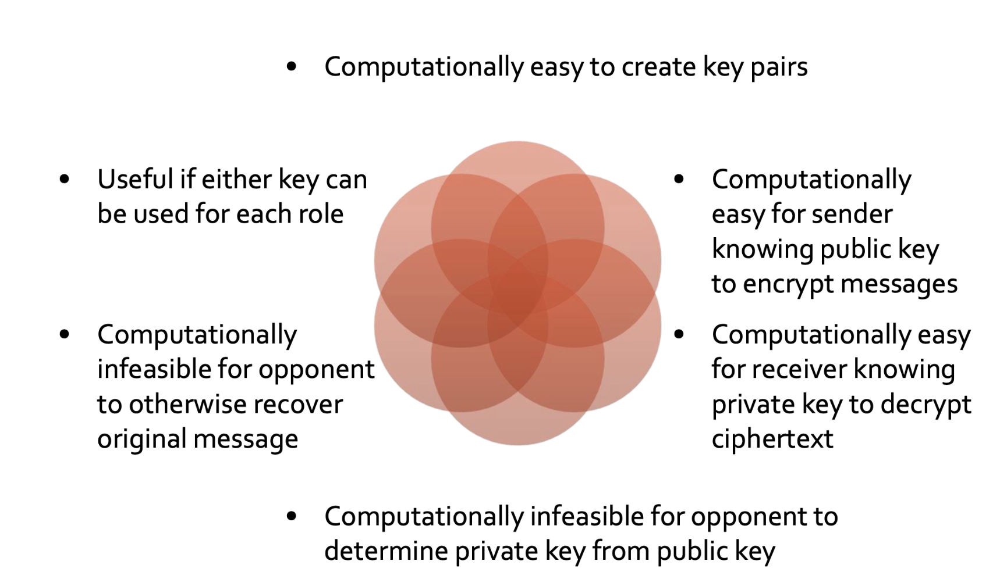
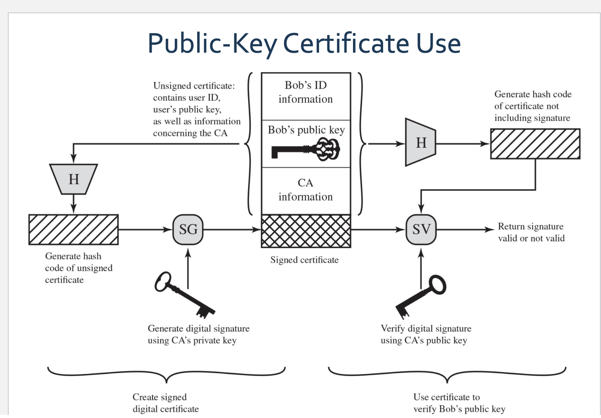
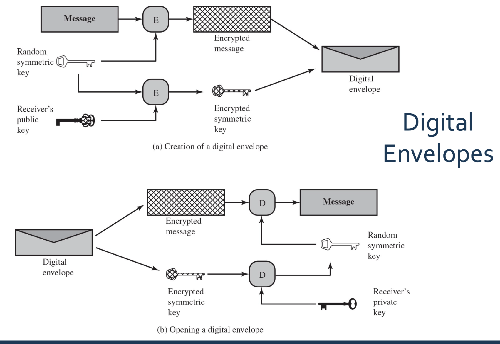

# Cryptographic_Tools
## Asymmetric Encryption
### Public-Key Encryption Structure
- Uses two separate keys
- Public key and private key
- Public key is made public for others to use
- Some form of protocol is needed for distribution

### requirements for public key encryption

### Asymmetric Encryption Algorithms
- RSA (Rivest, Shamir, Adleman)
- Diffie-Hellman key exchange algorithm: Enables two users to securely reach agreement about a shared secret 
- Digital Signature Standard (DSS): Provides only a digital signature

- Elliptic curve cryptography (ECC)

### Message Authentication
- Verify the contents of  message not altered (integrity)
- Verify the source is authentic (authenticity)
- Message is timely and in correct sequence (availablity)

### Message Authentication Code (MAC) 
the input of the encrypt function is the key and then content of the message. Then a MAC will generated based on the two elements. And Mac will be added to the end of the message. It can guarantee the authenticity and integrity of the message. 

## hash function
input the various length of message and generate a fixed number of string.
protect Integrity, but not authenticity.

## Hash Function H's property
- can be applied to a string of any size
- output must be a fixed length string
- H(x) should be easy to be computed for any given x
- **One-way or pre-image resistant** make  $H^{-1}(H(x))$ =x infeasible
- **Strong/Weak collision resistance** make it is infeasible to find a y, such that F(x) == F(y), where x!=y
- it is hard to find any pair of x and y such that h(x)==h(y), which is strong collison resistance. While weak resistance only requires for a certain x, no y can be found.

## Weak and Strong Hash Function
1. strong has function fits all the 6 requirements and with strong collison resistance. While the weak function has weak collison resistance. 

## digital signature
- a mechanism for verifying origin authentication, data integrity and signatory non-repudiation
- data-dependent bit pattern
- a digital signature is appended to the message
- Only the person with the private key should be able to generate the signature.
- The signature is realized as a function with the message x and the private key as input.
- The public key and the message x are the inputs to the verification function.

## certificate Auth

## Digital Envelopes
- Uses a Public-key (asymmetric ) encryption to protect a symmetric key
- Without needing to prior coordination for sender & receiver to have the same secret (symmetric) key

## random number
### Random Number Requirements
- Uniform distribution
- Unpredictability
- Independence

### Random Versus Pseudorandom
Pseudorandom:
- Sequences produced that satisfy statistical randomness tests
- Likely to be predictable.   
Random: 
- Uses a nondeterministic source to produce randomness
- Most operate by measuring unpredictable natural processes
