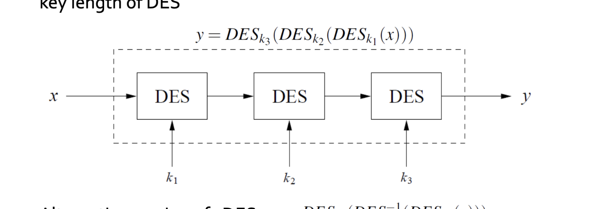
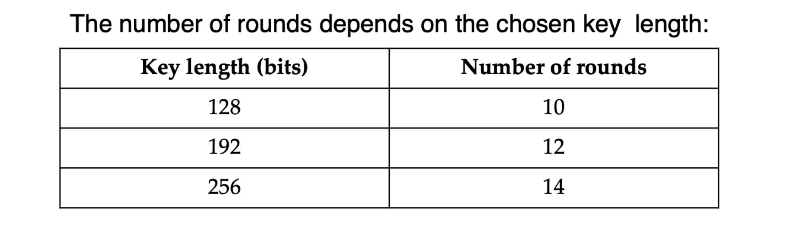
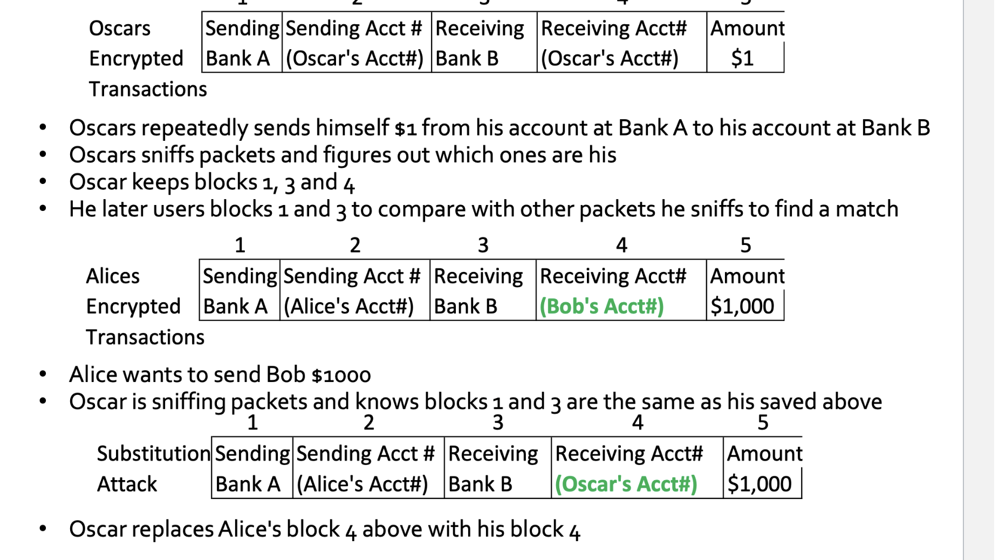
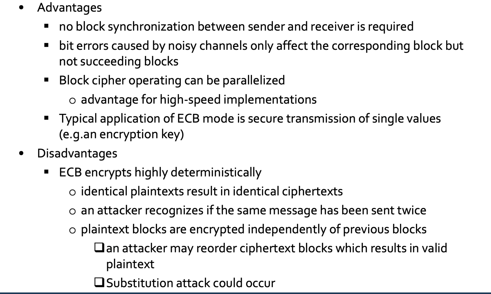

# Symmetric Encryption
## definition
1. Also referred to as conventional encryption or single-key encryption
2. Two requirements for secure use:
  - Need a strong encryption algorithm
  - Sender and receiver must have obtained copies of the secret key in a secure fashion and must keep the key secure
  
## Why do we need Cryptanalysis?
- There is no mathematical proof of security for any practial cipher
- The only way to have assurance that a cipher is secure is to try to break it (and fail) !
- Only use widely known ciphers that have been cryptanalyzed for several years by good cryptographers!

## Attacking Symmetric Encryption
### Cryptanalytic Attacks
1. Nature of the algorithm
2. Some knowledge of the general characteristics of the plaintext
3. Some sample plaintext-ciphertext pairs

> Exploits the characteristics of the algorithm to attempt to deduce a specific plaintext or the key being used.
 If successful, all future and past messages encrypted with that key are compromised
 

### Brute-Force Attacks
- Try all possible keys on some ciphertext until an intelligible translation into plaintext is obtained
- On average half of all possible keys must be tried to achieve success

## DES Facts
- Data Encryption Standard (DES) encrypts blocks of size 64 bit, produce Ciphertext of 64 bit with a key of 56 bit 
- Nowadays considered insecure due to the small key length of 56 bit.
- 3DES yields very secure ciphe

## Block Cipher Design Principles: Number of Rounds
The larger the number of rounds, the harder perform cryptanalytic. The goal here is to make cryptanalytic efforts harder than brutal force.

## Triple DES

Aternative way: DES~k3~(DES^-1^~k2~(DES~k1~(x)))
key size = 56*3 = 168 bits

## AES 
1. 128 bit data and 128/192/256 bit keys
2. the size of the key is dependent on the round of encrypt

## Modes of Operation
### ECB
1. all the blocks encrpyted with the same key.
2. Processes a series of sequentially listed bloc
3. Cryptanalysts may be able to exploit regularities in the plaintext
#### substitution attack

#### advantages/disadvantages

### CBD
1st plaintext block uses Initialization Vector (IV) to make encryption non-determinist yielding ciphertext c1, and the next block is encrypted depends on the c1, so on and so on.

### Stream Encryption
Processes input elements continuously. Key input to a pseudorandom bit generator. and it is unpredictable, without knowing the key.

