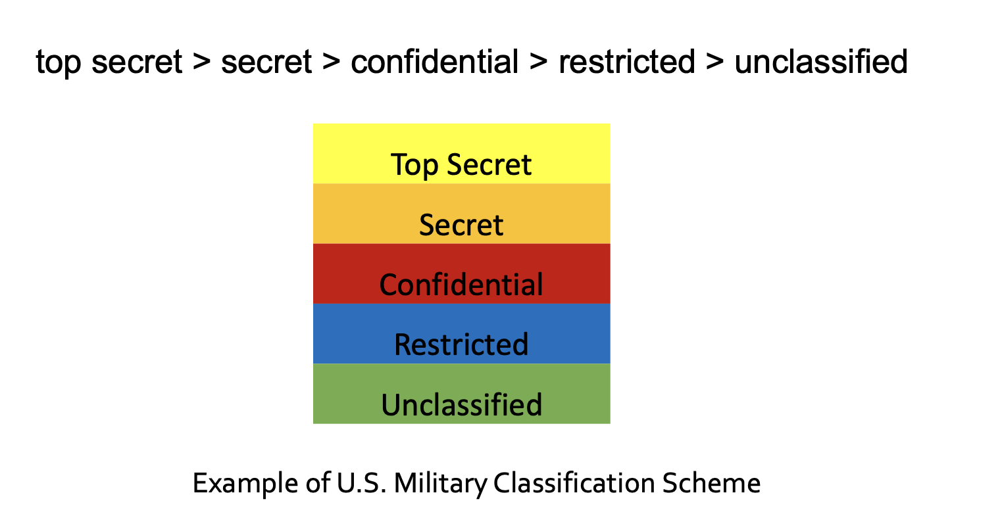
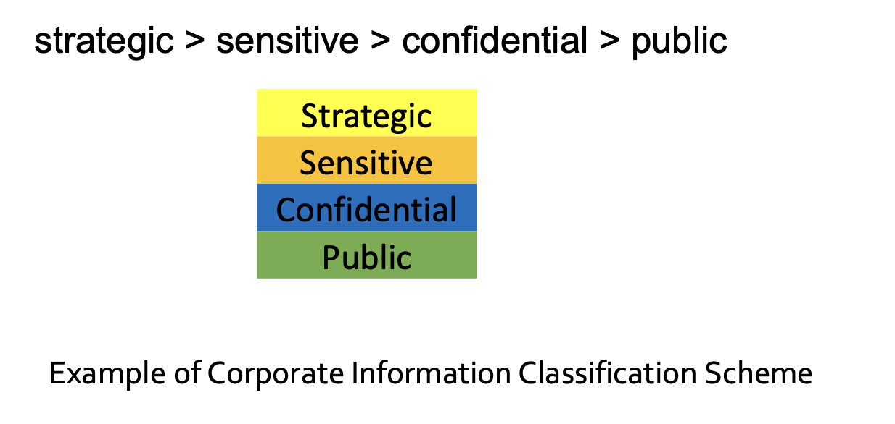
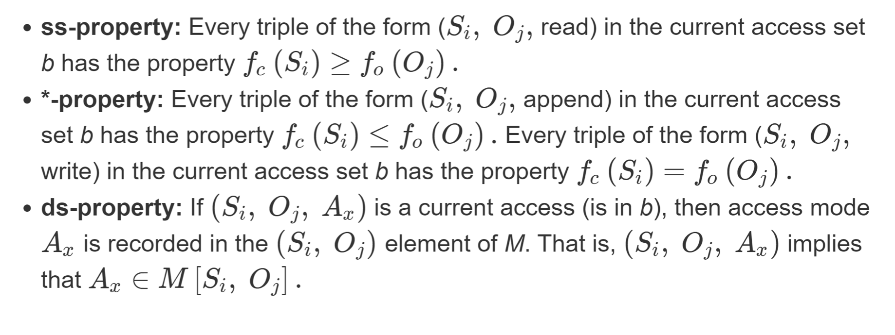
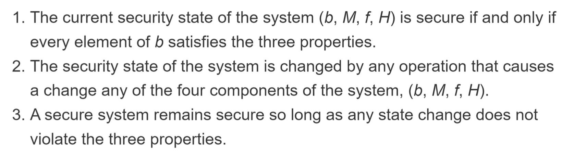
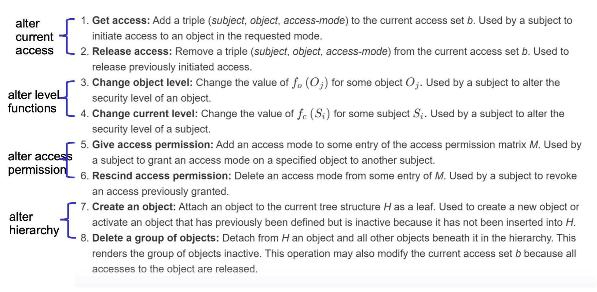

# Trusted Computing and Multilevel Security
## Confidentiality Policy
Goal: prevent the unauthorized disclosure of information
- Deals with information flow
– Extensive redundancy in military makes integrity/availability less of a problem

## confidentiality Requirement for Multilevel Security
- Multilevel security: multiple categories or levels of data are defined
- Requirement for confidentiality-centered MLS is that a subject at a high level may not convey into to a subject at a lower level unless that flow accurately reflects the will of an authorized user as revealed by an authorized declassification (declassification done outside of the BLP model)

## BLP
- Each subject and each object is assigned a security class
- Security classes form a strict hierarchy and are referred to as security levels

### Subjects, Objects, Modes of Access in BLP
- Subjects given a security clearance at a given level
- Objects given a security classification at a given level 
- Security classes control how a subject may access an object

### modes of access
- read: The subject is allowed only read access to the object
- append: The subject is allowed only write access to the object
- write: The subject is allowed both read and write access to the object
- execute: The subject is allowed neither read nor write access to the object but may invoke the object for execution

### 3 Properties
1. ss-property (no read up):  subject can only read an object of less or equal security level
2. *-property (no write down): a subject can only write into an object of greater or equal security level
3. ds-property: an individual (or role) may grant to another individual (or role) access to a document based on the owner’s discretion
    - but constrained by the MAC rules
    - Thus, a subject can exercise only accesses for which it has the necessary authorization, and which satisfy the MAC rules

- rule 1 and 2 compose MAC, 1, 2, and 3 compose DAC

#### Need for *-property
the malicious attacker may read the file of higher classification level and then write them to some lower classification files so that people with lower security clearance may read it.

### Formal Description of BLP Model
- Current state of system described by 4-tuple (b, M, f, H)
1. Current access set b: set of triples (subject, object, access-mode)
  - e.g.    (s, o, a) means subject s has current access to object o in access mode a; this doesn't mean s has access right to o
2.  Access matrix M_ij: matrix element 𝑀 records the access modes in which subject 𝑆 is permitted to access object 𝑂 
3. Level function 𝑓 – assigns security level to each subject and object. Has 3 mappings
      -  f_o(O_j): classification level of object O_j
      -  f_s(S_i): security clearance of subject S_i
      -  f_c(S_i): current security clearance level of subject S_i, since a subject can execute in the lower level.
4. Hierarchy H – directed rooted tree whose nodes correspond to objects in the system 
and

### System Starting In Secure State Remains Secure via BLP

### BLP Set of Rules

### Problems with BLP Model
- No provision to manage downgrade of an object
- Classification creep
    -  subject can only be “editing” (reading and writing) a file at one security level while also viewing files at the same or lower security level
    -   Thus, again, requires a process of managed downgrading of information is needed to restore reasonable classification levels.