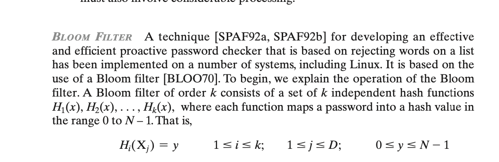
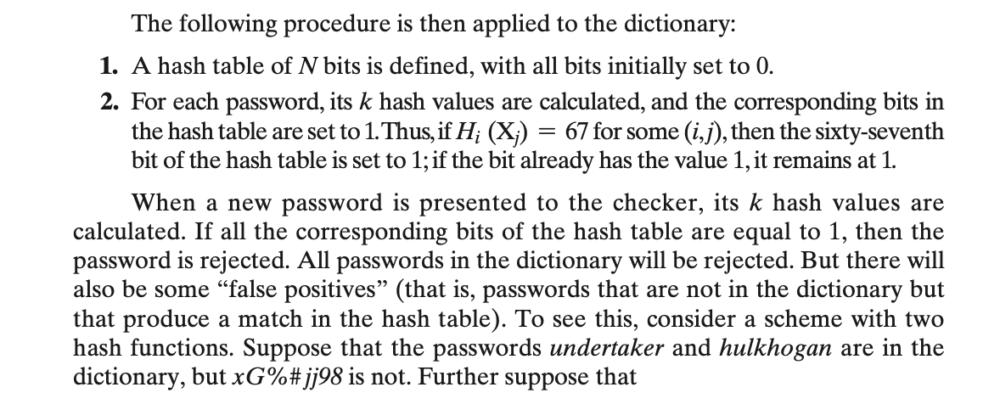
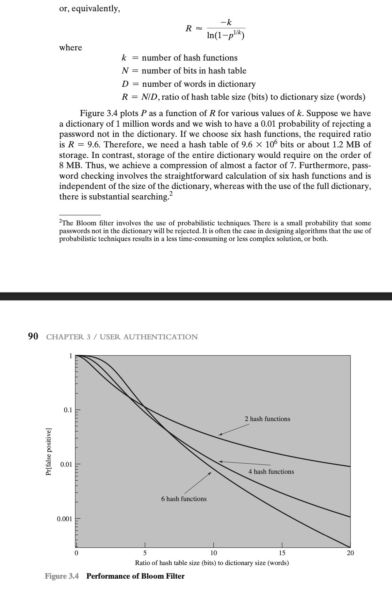

# User Authentication
## Digital User Authentication
- the process of establishing confidence in user  identities that are presented electronically to an information system

## User Authentication Two Functions
- Identify entity (info system users, processes acting on behalf of users, or devices) to the system, usually by presenting a credential such as a user ID

- Verify the user by the exchange of authentication information, e.g. a password

## Mechanisms for User Authentication:
- Use multifactor authentication for local and network access to privileged accounts and for network access to non-privileged accounts.
- Employ **replay-resistant** authentication mechanisms for network access
- Prevent reuse of identifiers for a defined period.
- Disable identifiers after a defined period of inactivity.
- Enforce a minimum password complexity and change of characters when new passwords are created.
- Prohibit password reuse for a specified number of generations. *
- Allow temporary password use for system logons with an immediate change to a permanent password.
- Store and transmit only cryptographically-protected passwords.
- Obscure feedback of authentication information

##  General Ways Means of Authenticating
- something the person has (a token), for example key fob
- something the person knows, PIN, password
- static biometrics
- dynamic biometrics

##  Multifactor Authentication
- use of more than one of the authentication means

## Password-Based Authentication
- Widely used line of defense against intruders
    - User provides name/login and password
    - System compares password with the one stored for that specified login
- The user ID:
    - Determines that the user is authorized to access the system
    - Determines the user’s privileges
    -  Is used in discretionary access control (DAC –more on this in later chapters)

### Offline Dictionary Attack
- The attack
  - hacker gain the access to the system password file
  - hackers compares the password hashes against hashes of commonly used passwords

- Countermeasures include 
  - controls to prevent unauthorized access to the password file, 
  - intrusion detection measures to identify a compromise
  - rapid reissuance of passwords should the password file be compromised
  
### Specific Account Attack
- attacker targets a specific account and submits password guesses until the correct password is discovered

- Standard countermeasure: account lockout mechanism - locks out access to the account after a number of failed login attempts

### Popular Password Attack
- variation of  specific account attack, prey on users with easy password
- Countermeasures
  - policies to inhibit the selection by users of common passwords 
  - scanning the IP addresses of authentication requests and client cookies or submission patterns

### Password Guessing Against A Single User
- attacker attempts to gain knowledge about the account holder and  system password policies and uses that knowledge to guess the  password 
- training in and enforcement of password policies that make passwords difficult to guess to address

### Workstation Hijacking
- attacker waits until a logged-in workstation is unattended

### Exploiting User Mistakes
- Exploiting user mistakes
  -   user writes down password (system assigned a difficult one to  remember)
  -   user intentionally shares a password e.g. to share files

### Electronic Monitoring
- passwords over a network to log onto a remote system vulnerable to eavesdropping
- Simple encryption will not fix this problem - the encrypted password is, in effect, the password and can be observed and reused by an adversary.

- countermeasution:  used hash passwords and a salt value  (see next slides for Unix example)
  
## UNIX Password Scheme
### Salt 
-  random value concatenated with a password before applying the one-way encryption function
-  Prevents duplicate passwords from being visible in the password file. 
#### Original scheme
- Up to eight printable characters in length
- 12-bit salt used to modify DES encryption into a one-way hash function
- Zero value repeatedly encrypted 25 times
- Output translated to 11 character sequence

#### Improved Implementations
Much stronger hash/salt schemes available for Unix
- Recommended hash function is based on MD5
- Salt of up to 48-bits
- Password length is unlimited
- Produces 128-bit hash
- Uses an inner loop with 1000 iterations to achieve slowdown

## Modern Approaches to Combat Password Cracking
### Complex password policy
- Forcing users to pick stronger passwords
- However password-cracking techniques have also improved
    - The processing capacity available for password cracking has increased dramatically
    - The use of sophisticated algorithms to generate potential passwords
    - Studying examples and structures of actual passwords in use

### Password File Access Control
- Can block offline guessing attacks by denying access to encrypted 
passwords

## Bloom Filter Operation
### definition

